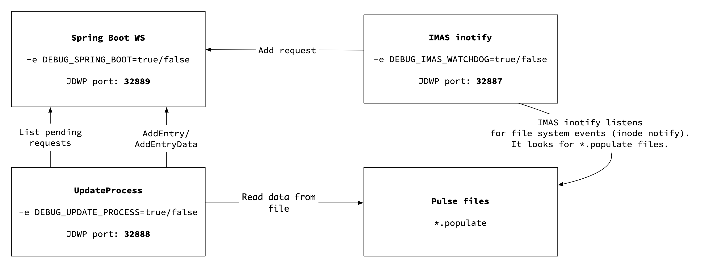

# Catalogue QT Docker

## Table of contents
* [Local installation](#local-installation)
* [Configuration](#configuration)
* [Remote installation](#remote-installation)
* [Developer informations](#developer-informations)
* [Container dependencies](#container-dependencies)
* [Troubleshooting download issues inside Docker](#troubleshooting-download-issues-inside-docker)
***
# Local installation

In order to build this container, you will need access to few repositories. This container is based on:

- `imas/ual`
- `catalog_qt_2`
- `dashboard-ReactJS`
- `imas-watchdog`
- `nginx`


## Make sure you can access imas/ual

This `Catalogue Qt 2 Docker` image is based on `imas/ual` Docker image. It is available from Docker registry `rhus-71.man.poznan.pl`.
Before you proceed, make sure you can access the registry. You can test it by executing following command

```
> docker login rhus-71.man.poznan.pl
```

You will be asked for a user name and password. If you don't have it, contact developer of this project.


## Make sure you can access dashboard-ReactJS

Docker image that contains Dashboard application can be downloaded from a Docker registry `registry.apps.man.poznan.pl`.
Before you proceed, make sure you can access the registry. You can test it by executing following command

```
> docker login registry.apps.man.poznan.pl/f4f/dashboard-ui/assets:branch-develop
```


## Make sure you can access catalog_qt_2

You will also need an access to `catalog_qt_2` project. Make sure you can access it. 
To do so, please go to folder `docker-compose/build` and in there execute this command:

```
> git clone --single-branch develop https://YOUR_USER_NAME@gforge6.eufus.eu/git/catalog_qt_2 
```

You will be asked for a user name and password. If you don't have it, contact developer of this project.


## Make sure you can access imas-watchdog project

This repository is publicly available. All you have to do, is to double check whether you can clone it in `docker-compose/build` folder.

```
> git clone --single-branch master https://github.com/tzok/imas-watchdog.git
```

 *** 
 
# Building container

In order to build and run container you have to do following

```
> cd docker-compose/build
> ./build.sh
```

**Note!** If you would like to pull the latest codes while rebuiling container please use `-force` flag  
**Note!** If you would like to build without cache use `-no-cache` flag  


# Starting container

Catalogue QT 2 Docker can be run using multiple configurations. By default we provide following configurations

```
api-allconfig.yml - all avaiable configuration in one file (you can comment particular lines to disable functionalities)
api-debug.yml - - configured for running Docker compose in debug mode (Web Services, Update Process, Scheduler)
api-development.yml - configured for development based Keycloak instance (user:pass - demo001:demo001)
api-noauth.yml - configured for running Docker compose in single-user mode (no tokens are used for authorization/authentication)
api-production.yml - configured for production Keycloak instance (eduTEAMS)
api-remote.yml - configuration for instalation on remote machines
proxy-noauth.yml - reverse-proxy configuration without SSL, which enables unsecured UI in webbrowser
proxy-auth-chara.yml - reverse-proxy configuration with SSL, which enable secured UI in webbrowser
ui-auth.yml - ui with kyecloak and TLS authentication
ui-debug.yml - 
ui-noauth.yml - ui without any authentication, for local instalation
ui-remote-chara.yml - configuration for instalation on remote machines  
```

You can run given configuration by calling

```
> cd docker-compose
# ./run.sh -s <configuration file suffix> e.g.
```


The most basic execution of our Catalog QT 2 on local machine is:

```
> ./run.sh -s api-noauth -s ui-noauth -s proxy-noauth
```

To access our application please paste this urls in your browser:

http://localhost/api/swagger-ui.html#/ to access Web Services via Swagger based UI.  
http://localhost/dashboard/ to access User-friendly Interface

***
# Configuration

## Docker-compose Configuration

**Note!** If you're not familiar with docker enviroment, please remember that building and running are diffrent!     
If you have already build container, you can change some of the configuration of containers without rebulding whole docker, which save a lot of time.  
To do so open configutation file `docker-compose._deployment_name_.yml` and change if you wish:

- The path where MySQL will store the data (default: `$(pwd)/db-data`)
- The path where pulsefiles are stored on the host (default: `$(pwd)/imasdb`)
- To map MySQL port to host port, so you can access the database from the container (by deafult no ports are exposed)
- To add custom configuration of Web Services: `application.properties` file  

Additionally you can  create your own e.g `docker-compose.myconf.yml` and run it!
```
> ./run.sh -s myconf
```  


 **Please look at `docker-compose.allconfig.yml` to see all avaiable configurations**  


## Catalog QT 2 Web Services Configuration

Moreover, in our `catalog-ws-server` we have `application.properties` file, which is a configuration for our Web Services in Springboot.
The explanation of this file is described here https://docs.psnc.pl/display/WFMS/Administration section `4.5.2.1. Anatomy of application.properties file`

The default configuration is inside our project, but (before building) if you want to use a diffrent configuration (e.g enabling SSL certificates, or changing ports) you can paste in folder `/catalogue_qt_docker/docker-compose/build/files/server` another `application.properties` file, which will have higher priority and would override existing file in source codes and then you can build and run our docker.

If you have already build container, and want to change Web Services configuration, you can do that without rebuilding docker!  
All you need to do is to add `application.properties` file to this folder `docker-compose/volumes/server-properties`.   
Then add this to your `docker-compose._deployment_name_.yml` in **server** section:
```
server:
  volumes:
    - ./volumes/server-properties:/home/imas/server-properties 
```
This line maps your `application.properties` on localhost to the file on container.    
When the container is taken off, it will have the highest priority.


After changing the settings, it may be necessary to restart from scratch:

```
> docker-compose rm
> docker-compose up
```

*** 
## Adding persistent storage

You can add persistent storage by setting it up inside `docker-compose.yml` file

```
services:
  db:
    volumes:
      - ./volumes/mysql:/var/lib/mysql
```

It is not required to link `./volumes/mysql` location. In case you are using some other location for persistent data, feel free to use it instead.

## Importing data from pulse file

Catalog QT Demonstrator allows to import MDSPlus based data automatically into SQL database. In order to do this you have to bind mount a volume. In a plain text it means that you have to tell Docker that you want to make your local filesystem to be available inside Docker container. Easiest way to do it is to create directory (or symbolic link) to a MDSPlus compatible local database.

First of all, make sure you have `MDSPlus` like directory structure with pulse files. The easiest way to execute Docker container with sample data is to get sample data from `box.psnc.pl` - these are completely artificially created data prepared by testing framework.

```
> curl -s -o f4f_data.tar.gz \
    https://box.psnc.pl/seafhttp/files/01953e73-8ad3-4277-be71-57b69c395355/f4f_data.tar.gz
```

Make sure your directories structure looks like this

```
.
`-- catalogue_qt_docker
    `-- docker-compose
        `-- volumes
            `-- imasdb
                |-- f4f
                |   `-- 3
                |       |-- 0
                |       |   |-- ids_11062020.characteristics
                |       |   |-- ids_11062020.datafile
                |       |   |-- ids_11062020.populate
                |       |   |-- ids_11062020.tree
                |       |   |-- ids_11062021.characteristics
                |       |   |-- ids_11062021.datafile
                |       |   |-- ids_11062021.populate
                |       |   `-- ids_11062021.tree
                |       |-- 1
                |       |-- 2
                |       |-- 3
                |       |-- 4
                |       |-- 5
                |       |-- 6
                |       |-- 7
                |       |-- 8
                |       `-- 9
                `-- script.sh
```

Directory `catalogue_qt_docker/docker-compose/volumes/imasdb` is automatically mounted inside Docker container. It means that anything you have put in it, will be visible inside Docker container whenever it is running. Once Docker is running you can schedule data population by creating file with `*.populate` extension. You can do it following way. Inside directory with data execute `script.sh` with the name of database you want to have populated.

```
> cd catalogue_qt_docker/docker-compose/volumes/imasdb
> ./script.sh f4f
```

<p align="center">
  
</p>


If anything goes wrong, please delete all the `.populate` files by executing this command on linux:
```
> find . -type f -name "*.populate" -delete  
```
And then try to import data again.
***


# Remote installation

You can use our codes on remote host machine in two ways:
- without any authentication
- with TLS/SSL authentication

**Note!**  Get a domain! This would be the best, instead of using an IP adress.

Our domain name for remote installation is: **chara-47.man.poznan.pl**

If you want to use it without authentication:
 - download, configure and build as said above
 - make sure you have opened 80 portto the ouside world on your host machine,

Otherwise, if you want to use is in secured mode, please do so:
- set up SSL certificate
- move certificates to docker volume
- make sure you have opened 443 port to the ouside world on your host machine


## Opening ports

On linux machine you could use `iptables` tool open particular ports.

To list which ports are opened run the below command
```
iptables -L
```

If these ports aren't open run the following command to allow traffic on port 80:
```
sudo iptables -I INPUT -p tcp -m tcp --dport 80 -j ACCEPT
```

Run the following command to allow traffic on port 443:
```
sudo iptables -I INPUT -p tcp -m tcp --dport 443 -j ACCEPT
```

Run the following command to save the iptables rules:
```
sudo service iptables save
```


Use the following one-line command to open the open the firewall ports:
```
sudo sh -c "iptables -I INPUT -p tcp -m tcp --dport 80 -j ACCEPT && iptables -I INPUT -p tcp -m tcp --dport 443 -j ACCEPT && service iptables save"
```

## Setting up an SSL certificate

**Note!** Remember - to obtain an SSL certificate you must have a domain!

The best way to obtain an SSL certificate is to use certbot. You can get certbot in multiple ways described https://certbot.eff.org/docs/install.html.

After installation, you need to obtain the raw `.pem` certificate and convert it to `.p12`. Do this by running 
```
certbot certonly --standalone 
```
Provide required information about your domain.

Required files will be located in /`etc/letsencrypt/live/name_of_your_domain` .

Go to this folder and run the command below. 

```
openssl pkcs12 -export -in fullchain.pem -inkey privkey.pem -out keystore.p12 -name tomcat -CAfile chain.pem -caname root
```

You will be asked to provide a password. Remember it as you will have to enter it in the `application.properties`.  
The output file `keystore.p12` is the file that has all the required information to set up SSL.

In `application.properties` enter this information:

```
server.ssl.key-store="path to your keystore.p12 file"
server.ssl.key-store-password="password to keystore.p12 file"
```

Congratulations! You have set up an SSL certificate!

## Moving SSL certificates /volumes/certs  

Firstly, create a directory
```
cd catalogue_qt_docker/docker-compose/volumes
mkdir certs
```
Then go to your `/etc/letsencrypt/live/name_of_your_domain` and execute:
 ```
 > ll
 -rw-r--r-- 1 root root  692 Oct 13 08:30 README
lrwxrwxrwx 1 root root   46 Oct 28 21:21 cert.pem -> ../../archive/name_of_your_domain/cert3.pem
lrwxrwxrwx 1 root root   47 Oct 28 21:21 chain.pem -> ../../archive/name_of_your_domain/chain3.pem
lrwxrwxrwx 1 root root   51 Oct 28 21:21 fullchain.pem -> ../../archive/name_of_your_domain/fullchain3.pem
-rw------- 1 root root 5.7K Oct 28 21:22 keystore.p12
lrwxrwxrwx 1 root root   49 Oct 28 21:21 privkey.pem -> ../../archive/name_of_your_domain/privkey3.pem

 ```
As you can see these are soft links to proper certificates file. 
In this case these files have numbers in its name (number of last renewed certificate).

To properly mount our cert files to docker container, we need to copy those files to our `/volumes/certs`, **not symlinks**.
We need to copy 3 files:
- keystore.p12
- cert3.pem
- privkey3.pem

```
cp archive/domain-name/keystore.p12 ~/catalogue_qt_docker/docker-compose/volumes/cert
cp archive/domain-name/cert3.pem ~/catalogue_qt_docker/docker-compose/volumes/cert
cp archive/domain-name/privkey3.pem ~/catalogue_qt_docker/docker-compose/volumes/cert
```

## Reverse-Proxy configuration with nginx 

Reverse proxy enables us to properly distinguish urls and ports in our containerized enviroment.

### volumes/nginx-ssl-chara

**Note!**Please update names of cert files, to be the same as the ones in `/volumes/certs`
```
server {
    listen 443 ssl;
    server_name your_domain_name;
    ssl_certificate /etc/nginx/certs/cert3.pem; 
    ssl_certificate_key /etc/nginx/certs/privkey3.pem;
    
..... rest stays the same ....

}

```


### docker-compose.proxy-ssl-chara.yml
```
version: "3.6"
services:
  proxy:
    image: nginx
    volumes:
    
    #This is our directory for nginx configuration
      - ./volumes/nginx-ssl-chara:/etc/nginx/conf.d:ro
      
     #This is where our certs are mounted 
      - ./volumes/certs:/etc/nginx/certs:ro
    ports:
      - 443:443
    depends_on:
      - server
      - react

  react:
    environment:
    #This is our domain name 
      - CATALOG_QT_API_URL=https://domain_name/api
```


### docker-compose.api-remote.yml
Please open (or copy and rename) this file and configure with proper monuting folders for your experiment data!


So now you are ready to run Catalog QT 2 on remote host!

- without SSL/TLS
```
./run.sh -s api-noauth -s ui-noauth -s proxy-noauth
```
http://your-domain-name/dashboard/  
https://your-domain-name/api/swagger-ui.html/  


http://chara-47.man.poznan.pl/api/swagger-ui.html  
http://chara-47.man.poznan.pl/dashboard/


- with SSL/TLS enabled
```
./run.sh -s api-remote -s ui-auth -s proxy-auth

```
https://your-domain-name/dashboard/  
https://your-domain-name/api/swagger-ui.html/  
  
https://chara-47.man.poznan.pl/api/swagger-ui.html  
https://chara-47.man.poznan.pl/dashboard/

You will see login page. You can login with:
`(user:pass - demo001:demo001)`
or your LDAP account.


# Developer informations

## Debugging in docker-compose

You can debug either all the Java based components, inside Docker container, or you can specify which one should be started in debug more. For debugging Java code inside Docker containers we are using `JDWP` protocol, and by default we are using following ports

```
Web Services   - 32889
Update process - 32888
imas-watchdog  - 32887
```



In order to enable debbug mode you can either use predefined `docker-compose.debug.yml` or enable debug mode for each service separatelly by adding sections inside your YAML file of choice.

### Catalog-ws-server

To debug catalog-ws-server you need to add following lines to `docker-compose.####.yml` in `server` section

```yaml
  server:
    volumes:
      - ./volumes/imasdb:/home/imas/public/imasdb
      - /path/to/your/directory/catalog_qt_2/server/catalog-ws-server:/catalog_qt_2/server/catalog-ws-server #1
    ports:
      - 32889:32889 
    environment: 
      - DEBUG_SPRING_BOOT=true 
```

If you want to develop Catalog QT 2 codes in a easy way with connection to container you should:

1. Clone the repo of `catalog_qt_2` outside `catalogue_qt_docker` directory (e.g. `/Desktop`).
2. Run `./compile.sh` script in chosen folder directory.
3. Map your choosen directory path on localhost to directory of `catalog_qt_2` codes on `docker-compose_server_1` container directory  .
   This is what `#1` line is doing.  
4. Rerun container.
5. You will see that Spring isn't taking off - that means it waits for a remote debbuger to connect!
6. Go to your IDE - we are using Intellij IDE.   
   a. top left corner -> click `+` `Add new configuration`   
   b. choose `Remote JVM Debug`  
   c. set settings as in a screen shot above (**Important!!** change port to **32889** or diffrent one set in `docker-compose.####.yml`    
   d. run debug mode in IDE  
7. In your konsole you will see that Spring is taken off!
8. Go to your IDE and set breakpoint
9. In Swagger or Postman send proper request on port 8080


**If this works - bravo!! You're ready to debug!**


### Update process

To debug update-process you need to add following lines to `docker-compose.####.yml` in `updateprocess` section

```yaml
  updateprocess:
    volumes:
      - ./volumes/imasdb:/home/imas/public/imasdb
    ports:
      - 32888:32888
    environment:
      - DEBUG_UPDATE_PROCESS=true
```

### Watchdog

To debug imas-watchdog you need to add following lines to `docker-compose.####.yml` in `updateprocess` section

```yaml
  watchdog:
    volumes:
      - ./volumes/imasdb:/home/imas/public/imasdb
      - ./volumes/fair4fusion-docker-demo:/docker-entrypoint-properties.d
    ports:
      - 32887:32887
    environment:
      - DEBUG_IMAS_WATCHDOG=true
```


# Container dependencies


-   Container `server` connects to `db`. The connection URL is in file: `catalog_qt_2/server/catalog-ws-server/src/main/resources/application.properties` in line:

    ```
    spring.datasource.url=jdbc:mysql://localhost:3306/itm_catalog_qt?serverTimezone=UTC
    ```

    This line is changed by `sed` in Dockerfile to correct value. If you want to change `db` container name in `docker-compose.yml`, then edit the Dockerfile and rebuild `catalogqt/server`.

-   Container `updateprocess` connects to `server`. The connection URL is hard-coded in the main command `/updateprocess.sh` in the last lines:

    ```
    exec java -jar target/catalogAPI.jar \
        -startUpdateProcess \
        --url http://server:8080 \
        --scheme mdsplus \
        --slice-limit 100
    ```

    If you want to change `server` container name in `docker-compose.yml`, then edit `build/files/updateprocess.sh` and rebuild `catalogqt/updateprocess` image.

-   Container `watchdog` connects to `server`. The connection URL is configurable in the `config.ini` file of `tzok/imas-watchdog` project. Currently, the file in `master` branch has a valid URL. If you want to change `server` container name in `docker-compose.yml`, then (1) create a copy of `config.ini` from `tzok/imas-watchdog`, (2) change its `url` line, (3) add `COPY` instruction to Dockerfile's part related to `catalogqt/inotify` and (4) rebuild this image.

-   Container `dashboard` connects to `server` The connection URL is set in `demonstrator-dashboard/db_api/services.py` in line starting with `API_ROOT = `. This line is changed by `sed` in the Dockerfile

# Troubleshooting download issues inside Docker

It may happen that frame size of network interfaces might be missaligned between your hardware and virtual network creted by Docker. In that case you can experience strange issues with network. For example, your data transfer rate drops to `0 kb/s`. You can examine this missalignment follwoing way: 

```
> ip link
2: ens3: <BROADCAST,MULTICAST,UP,LOWER_UP> mtu 1458 qdisc fq_codel state UP mode DEFAULT group default qlen 1000
    link/ether ....
148: br-9533f8101c29: <BROADCAST,MULTICAST,UP,LOWER_UP> mtu 1500 qdisc noqueue state UP mode DEFAULT group default
    link/ether ... brd ff:ff:ff:ff:ff:ff
```

This may lead to issues while transferring data. To solve this issue you may need to change your `/etc/docker/daemon.json` file by adding

```
{
  "mtu": ${SIZE_OF_THE_FRAME_OF_YOUR_NETWORK_DEVICE}
}
```

for the above exaple it will be

```
{
  "mtu": 1458
}
```

If you are using docker-compose you want to modify `docker-compose.yml` as well

```
...
...

networks:
  default:
    driver: bridge
    driver_opts:
      com.docker.network.driver.mtu: 1458

...
...
```

## Restart might be required

In case you have started your container already, you might have your network interface recreated. If you get following error after altering Docker's settings

```
> docker-compose up
ERROR: Network "docker-compose_default" needs to be recreated - option 
  "com.docker.network.driver.mtu" has changed
```

make sure to remove the network and bring everything up again

```
> docker-compose rm
> docker network ls
> docker network rm docker-compose_default # name of your network might depend on your settings
> docker-compose up
```

This should solve your issue, all interfaces should have `MTU` being aligned

```
...
...
2: ens3: <BROADCAST,MULTICAST,UP,LOWER_UP> mtu 1458 qdisc fq_codel state UP mode DEFAULT group default qlen 1000
    link/ether ... brd ff:ff:ff:ff:ff:ff
148: br-9533f8101c29: <BROADCAST,MULTICAST,UP,LOWER_UP> mtu 1458 qdisc noqueue state UP mode DEFAULT group default
    link/ether ... brd ff:ff:ff:ff:ff:ff
150: vetha4ad5b7@if149: <BROADCAST,MULTICAST,UP,LOWER_UP> mtu 1458 qdisc noqueue master br-9533f8101c29 state UP mode DEFAULT group default
    link/ether ... brd ff:ff:ff:ff:ff:ff link-netnsid 0
152: veth8514865@if151: <BROADCAST,MULTICAST,UP,LOWER_UP> mtu 1458 qdisc noqueue master br-9533f8101c29 state UP mode DEFAULT group default
    link/ether ... brd ff:ff:ff:ff:ff:ff link-netnsid 1
154: vethee2a6b9@if153: <BROADCAST,MULTICAST,UP,LOWER_UP> mtu 1458 qdisc noqueue master br-9533f8101c29 state UP mode DEFAULT group default
    link/ether ... brd ff:ff:ff:ff:ff:ff link-netnsid 2
156: vethb90a412@if155: <BROADCAST,MULTICAST,UP,LOWER_UP> mtu 1458 qdisc noqueue master br-9533f8101c29 state UP mode DEFAULT group default
    link/ether ... brd ff:ff:ff:ff:ff:ff link-netnsid 3
158: vethf56cc8a@if157: <BROADCAST,MULTICAST,UP,LOWER_UP> mtu 1458 qdisc noqueue master br-9533f8101c29 state UP mode DEFAULT group default
    link/ether ... brd ff:ff:ff:ff:ff:ff link-netnsid 4
...
...
```
