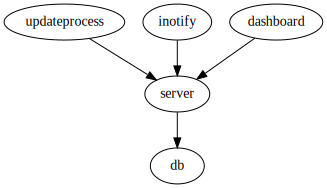

# Building the images

Be prepared to:

- Login into `rhus-71.man.poznan.pl` Docker registry
- Login into `gforge6.eufus.eu` project named `catalog_qt_2`
- Login into `gitlab.com` project named `fair-for-fusion/demonstrator-dashboard`

```
cd build
./build.sh
```

# Running

```
docker-compose up
```

# Configuration

You can edit `docker-compose.override.yml` to change:

- The path where MySQL will store the data (default: `$(pwd)/db-data`)
- The path where pulsefiles are stored on the host (default: `$(pwd)/imasdb`)
- To map MySQL port to host port, so you can access the database from the container (by deafult no ports are exposed)

After changing the settings, it may be necessary to restart from scratch:

```
docker-compose rm
docker-compose up
```

# Container dependencies



-   Container `server` connects to `db`. The connection URL is in file: `catalog_qt_2/server/catalog-ws-server/src/main/resources/application.properties` in line:

    ```
    spring.datasource.url=jdbc:mysql://localhost:3306/itm_catalog_qt?serverTimezone=UTC
    ```

    This line is changed by `sed` in Dockerfile to correct value. If you want to change `db` container name in `docker-compose.yml`, then edit the Dockerfile and rebuild `catalogqt/server`.

-   Container `updateprocess` connects to `server`. The connection URL is hard-coded in the main command `/updateprocess.sh` in the last lines:

    ```
    exec java -jar target/catalogAPI.jar \
        -startUpdateProcess \
        --url http://server:8080 \
        --scheme mdsplus \
        --slice-limit 100
    ```

    If you want to change `server` container name in `docker-compose.yml`, then edit `build/files/updateprocess.sh` and rebuild `catalogqt/updateprocess` image.

-   Container `inotify` connects to `server`. The connection URL is configurable in the `config.ini` file of `tzok/imas-inotify` project. Currently, the file in `master` branch has a valid URL. If you want to change `server` container name in `docker-compose.yml`, then (1) create a copy of `config.ini` from `tzok/imas-inotify`, (2) change its `url` line, (3) add `COPY` instruction to Dockerfile's part related to `catalogqt/inotify` and (4) rebuild this image.

-   Container `dashboard` connects to `server` The connection URL is set in `demonstrator-dashboard/db_api/services.py` in line starting with `API_ROOT = `. This line is changed by `sed` in the Dockerfile

# Developer informations

## Debugging in docker-compose

### Catalog-ws-server

To debug catalog-ws-server you need to add specific lines to `docker-compose.override.yaml` in `server` section

```yaml
  server:
    volumes:
      - ./imasdb:/home/imas/public/imasdb
      - ./build/catalog_qt_2:/catalog_qt_2 #1
    ports:
      - 5005:5005 #2
    environment: 
      - DEBUG=1 #3
```

1. Maps your code on host machine to the code inside container, allowing you to use your favourite IDE debugger capabilities. Also, you can change your code and run `docker-compose restart` to rerun container. This allows container to integrate your newest code.

2. Exposes port for Java debugger, usually `5005`.

3. Enables debugging on catalog-ws-server.

You also need to run 

`echo '' > build/files/server/application.properties.patch`

and in `catalog_qt_2/server/catalog-ws-server/src/main/resources/application.properties` change

```diff
-spring.datasource.url=jdbc:mysql://localhost:3306/itm_catalog_qt?serverTimezone=UTC
+spring.datasource.url=jdbc:mysql://db:3306/itm_catalog_qt?serverTimezone=UTC
```
